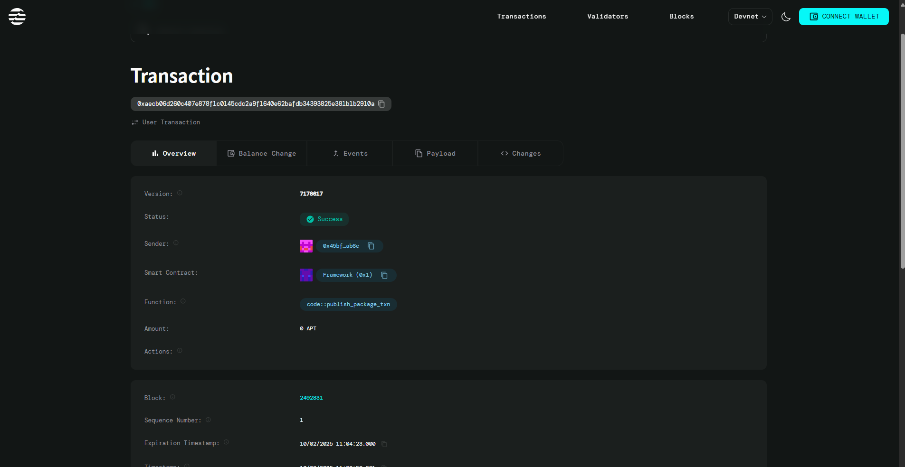

# 🎉 Kudos Board — Fullstack Aptos Token Tipping App

Kudos Board is a **fullstack blockchain project** built on the Aptos network, allowing users to send token-based kudos to each other.  
The project includes a **Move smart contract** and a **React + Vite frontend** with Petra Wallet integration.

---

## 📦 Project Components

### **Move Smart Contract**
Located in `sources/kudos_board.move`, this contract provides the core logic for Kudos Board.

**Main Functions:**
- `initialize_profile()` — Creates a Kudos profile for a user.
- `send_kudos(address recipient, u64 amount)` — Allows sending kudos (APT tokens) to another address.

**Features:**
- KudosProfile struct to track kudos received by users.
- Token transfer using AptosCoin.
- Efficient contract structure under 50 lines of Move code.

---

### **Frontend**
Located in the `frontend` directory, built with React + Vite.

**Features:**
- Beautiful gradient UI with purple, pink, and blue tones.
- Wallet connection via Petra Wallet.
- Create profile and send kudos forms.
- Real-time transaction feedback.
- Responsive layout for desktop and mobile.

---

## 🚀 Setup Instructions

### 1️⃣ Project Structure
```
kudos_board/
├── sources/
│ └── kudos_board.move
├── Move.toml
└── frontend/
├── src/
│ ├── App.jsx
│ ├── App.css
│ ├── main.jsx
│ └── index.css
├── package.json
└── index.html
```

---

### 2️⃣ Create the Move Smart Contract

Example: `sources/kudos_board.move`
```move
module MyModule::KudosBoard {
    use aptos_framework::signer;
    use aptos_framework::coin;
    use aptos_framework::aptos_coin::AptosCoin;

    struct KudosProfile has store, key {
        total_kudos: u64,
    }

    public fun initialize_profile(account: &signer) {
        // Logic to initialize profile
    }

    public fun send_kudos(sender: &signer, recipient: address, amount: u64) {
        // Logic to send kudos
    }
}
```
### 3️⃣ Update Move.toml
```
[package]
name = "kudos_board"
version = "1.0.0"
authors = []

[addresses]
MyModule = "_"

[dependencies.AptosFramework]
git = "https://github.com/aptos-labs/aptos-core.git"
rev = "mainnet"
subdir = "aptos-move/framework/aptos-framework"

```
### 4️⃣ Setup Frontend
```
# Create frontend directory
npm create vite@latest frontend -- --template react
cd frontend
npm install

# Install Aptos SDK and wallet adapter
npm install @aptos-labs/ts-sdk @aptos-labs/wallet-adapter-react @aptos-labs/wallet-adapter-ant-design petra-plugin-wallet-adapter

```
### 5️⃣ Complete Setup & Deployment

Compile and Deploy Move Module
```
aptos init
aptos move compile
aptos move publish

```

**Update Frontend Configuration**

- Copy your deployed module address.

- Update `MODULE_ADDRESS` in `frontend/src/App.jsx.`

**Run Frontend**
```
cd frontend
npm install
npm run dev

```
### 6️⃣ Testing the App

- Install Petra Wallet (Chrome extension).

- Create/import wallet and switch to Devnet.

- Get test tokens from Aptos Faucet.

- Connect wallet to the app.

- Initialize profile (first time only).

- Send kudos to another address.


---

## 🌍Contact Details
0xaecb06d260c407e878f1c0145cdc2a9f1640e62bafdb34393825e381b1b2910a



